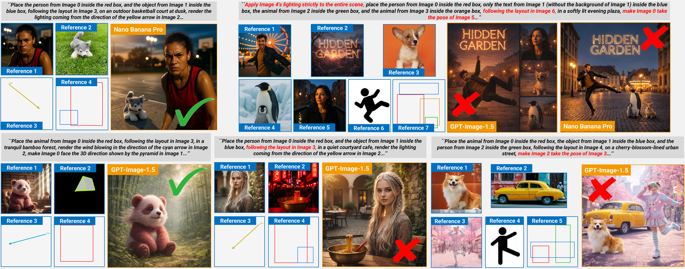
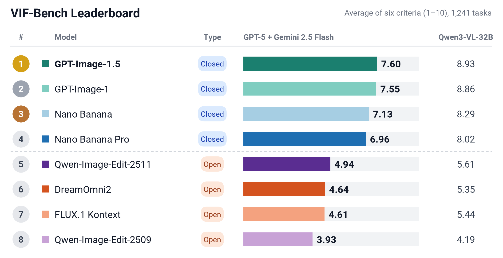

<h1 align="center">VIF-Bench: Evaluating Visual Instruction Following in Multi-Reference Image Generation</h1>

<p align="center">
    <b>Yuta Oshima*, Masakazu Yoshimura*, Masahiro Suzuki, Yutaka Matsuo, Hiroki Furuta</b><br>
    (*equal contribution)
</p>

<p align="center">
    <a href="#">
      
    </a>
    <a href="https://huggingface.co/datasets/shim0114/VIF-Bench">
        
    </a>
</p>

<details open><summary>💡 We also have other multi-reference image generation projects that may interest you ✨</summary><p>

> [**MultiBanana: A Challenging Benchmark for Multi-Reference Text-to-Image Generation**](https://arxiv.org/abs/2511.22989) <br>
> **CVPR 2026 (Main)** <br>
> Yuta Oshima, Daiki Miyake, Kohsei Matsutani, Yusuke Iwasawa, Masahiro Suzuki, Yutaka Matsuo, Hiroki Furuta <br>
> [](https://cvpr.thecvf.com/)
> [](https://github.com/matsuolab/multibanana)
> [](https://github.com/matsuolab/multibanana)
> [](https://arxiv.org/abs/2511.22989) <br>

> [**AutoRef: Harness Optimization for Agentic Multi-Reference Image Generation**](https://arxiv.org/abs/2609.35530) <br>
> Yuta Oshima, Ku Onoda, Yusuke Iwasawa, Masahiro Suzuki, Yutaka Matsuo, Hiroki Furuta <br>
> [](https://github.com/KuOnoda/AutoRef)
> [](https://github.com/KuOnoda/AutoRef)
> [](https://arxiv.org/abs/2609.35530) <br>

</p></details>

<p align="center">
  
</p>

VIF-Bench evaluates how well image generation models follow **visual instructions** (layouts,
3D orientations, light and wind arrows, and poses) while composing **multiple reference images**.
It covers multi-reference generation (up to 7 references) under **multiple heterogeneous visual
instructions** (up to 6), cases where reference images **potentially compete with visual
instructions** (e.g., a strongly posed subject vs. a target pose), and a controlled comparison of
**visual and text instructions**.

## 🥇 Leaderboard

VIF-Bench comprises **1,241 tasks** designed to evaluate visual instruction following in
multi-reference image generation. We report the average of six criteria scored by **GPT-5** and
**Gemini 2.5 Flash**, together with the scores of **Qwen3-VL-32B-Instruct**, a fixed, open-weight
judge model.

<p align="center">
    
</p>

## 📦 Dataset

The data structure at the [Hugging Face dataset](https://huggingface.co/datasets/shim0114/VIF-Bench) is as follows.

```
data/
├── metadata.jsonl          # one row per task
├── tasks/
│   ├── v6_n2_00/
│   │   ├── Image_0.png
│   │   ├── Image_1.jpg
│   │   ├── ...
│   │   └── instruction.txt
│   └── ...
├── text_instruction/       # dense.jsonl / medium.jsonl / sparse.jsonl
└── labels/
    └── vi_conflicts.jsonl
```

Download VIF-Bench by

```
hf download shim0114/VIF-Bench --repo-type dataset --local-dir ./data
```

## 🛠️ Setup

```bash
git clone https://github.com/shim0114/VIF-Bench.git
cd VIF-Bench

conda create -n vifbench python=3.12
conda activate vifbench

pip install -r requirements.txt
```

Please set your API keys in `.env` as follows (see `.env.example`).

```
OPENAI_API_KEY=...
GEMINI_API_KEY=...
```

## 🎨 Generation

We provide a generation script for the API models evaluated in the paper
(`nano_banana_pro`, `nano_banana`, `gpt_image_1_5`, `gpt_image_1`).

```bash
python generate.py --data_dir ./data --model nano_banana_pro
```

## 🧪 Evaluation

Generated images are expected to be saved as `<task_id>.png`, one directory per model
(`generate.py` saves them this way).

```
generations/
└── nano_banana_pro/
    ├── v1_000.png
    ├── v6_n2_00.png
    └── ...
```

We use `gpt-5-2025-08-07` via the OpenAI SDK, `gemini-2.5-flash` via the Google GenAI SDK, and
`Qwen/Qwen3-VL-32B-Instruct` via Hugging Face Transformers.

Run

```bash
# GPT
python judge.py --data_dir ./data --generated_dir ./generations/nano_banana_pro --judge gpt

# Gemini
python judge.py --data_dir ./data --generated_dir ./generations/nano_banana_pro --judge gemini

# Qwen3-VL (local GPUs)
python qwenvl_judge.py --data_dir ./data --generated_dir ./generations/nano_banana_pro
```

This will save the judge outputs and scores in `results/<model>/<judge>/`.
The scores averaged over GPT and Gemini are summarized by the following (`--judges qwen3vl` for Qwen3-VL).

```bash
python summarize.py --data_dir ./data --results_dir ./results
```

## 🏷️ Annotation

The dataset released on Hugging Face includes the following annotations:

**Reference–Visual Instruction Conflict**

`labels/vi_conflicts.jsonl` marks tasks in which a reference image potentially competes with its
visual instruction. `summarize.py --by conflict` compares tasks with and without conflicts.

**Text-Converted Instructions**

`text_instruction/` contains the visual instructions converted into text at three levels of detail
(dense, medium and sparse). `generate.py --instruction dense` generates images from them.

**Source of Reference Images**

The `source_type` field of each image in `metadata.jsonl` indicates whether the reference image
originates from a real dataset or was synthetically generated.

## 📄 License

Creative Commons Attribution Non Commercial 4.0 ([LICENSE](LICENSE))

## 🙏 Acknowledgement

VIF-Bench incorporates images from [LAION-5B](https://laion.ai/blog/laion-5b/),
[DreamOmni2](https://github.com/dvlab-research/DreamOmni2), [DreamBooth](https://dreambooth.github.io/)
and [VIBE](https://github.com/hwanyu112/VIBE-Benchmark).
We thank the authors of these datasets for making them openly available.
Our evaluation framework relies on [Qwen3-VL](https://github.com/QwenLM/Qwen3-VL) as a fixed,
open-weight judge model, and we are grateful to the Qwen team.

We appreciate the teams behind the models we evaluate: [Nano Banana Pro and Nano Banana](https://deepmind.google/models/gemini-image/)
from Google DeepMind, [GPT-Image-1.5 and GPT-Image-1](https://openai.com/index/image-generation-api/) from OpenAI,
[Qwen-Image-Edit](https://github.com/QwenLM/Qwen-Image), [FLUX.1 Kontext [dev]](https://github.com/black-forest-labs/flux)
and [DreamOmni2](https://github.com/dvlab-research/DreamOmni2).

## 🌟 Citation

```bibtex

@inproceedings{oshima2026multibanana,
    author    = {Oshima, Yuta and Miyake, Daiki and Matsutani, Kohsei and Iwasawa, Yusuke and Suzuki, Masahiro and Matsuo, Yutaka and Furuta, Hiroki},
    title     = {MultiBanana: A Challenging Benchmark for Multi-Reference Text-to-Image Generation},
    booktitle = {Proceedings of the IEEE/CVF Conference on Computer Vision and Pattern Recognition (CVPR)},
    month     = {June},
    year      = {2026},
    pages     = {448-460}
}

@misc{oshima2026autoref,
      title={AutoRef: Harness Optimization for Agentic Multi-Reference Image Generation}, 
      author={Yuta Oshima and Ku Onoda and Yusuke Iwasawa and Masahiro Suzuki and Yutaka Matsuo and Hiroki Furuta},
      year={2026},
      eprint={2609.35530},
      archivePrefix={arXiv},
      primaryClass={cs.CV},
      url={https://arxiv.org/abs/2609.35530}, 
}

```
