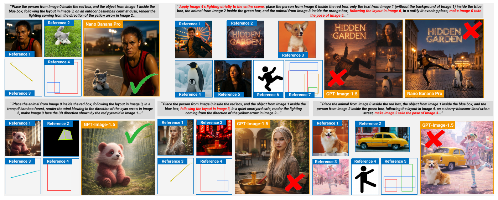
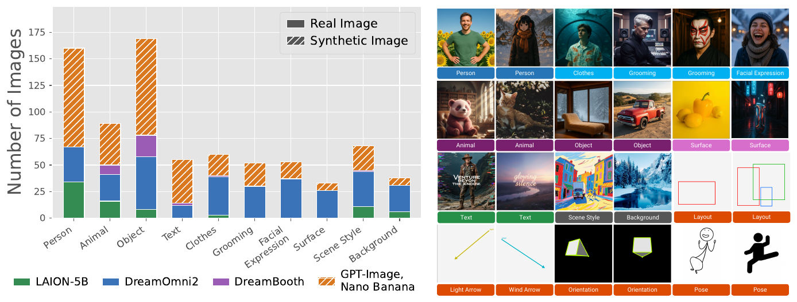

<h1 align="center">VIF-Bench: Evaluating Visual Instruction Following in Multi-Reference Image Generation</h1>

<p align="center">
    <b>Yuta Oshima*, Masakazu Yoshimura*, Masahiro Suzuki, Yutaka Matsuo, Hiroki Furuta</b><br>
    The University of Tokyo &nbsp;&nbsp; (*equal contribution)
</p>

<p align="center">
    <a href="#">
      
    </a>
    <a href="https://huggingface.co/datasets/shim0114/VIF-Bench">
        
    </a>
</p>

<p align="center">
  
</p>

Recent image generation models can take multiple images and textual instructions as input,
enabling reference-based generation guided not only by text but also by **visual instructions**
such as layouts, arrows and pose cues. VIF-Bench is a benchmark of **1,241 tasks** that evaluates
this joint setting, covering:

- **multi-reference generation** (up to 7 references) under **multiple heterogeneous visual
  instructions** (up to 6),
- cases where reference images can **potentially compete with visual instructions**
  (e.g., a strongly posed subject vs. a target pose), and
- a controlled comparison of **visual instructions with text descriptions** at different levels of
  specificity.

<p align="center">
  
</p>

## 🥇 Leaderboard

<p align="center">
  
</p>

Each generated image is scored on a 10-point scale along six criteria, and models are ranked by
their average. The main score uses **GPT-5** and **Gemini 2.5 Flash** as judges (the average of the
two); **Qwen3-VL-32B-Instruct** is a fixed-version open-weight judge that lets you evaluate without
proprietary APIs.

<details>
<summary><b>Scores per criterion</b></summary>

**GPT-5 + Gemini 2.5 Flash**

| Model | Text Instruction Following | Reference Consistency | Visual Instruction Adherence | Visual Instruction Cleanliness | Scene Coherence | Visual Quality | Avg. |
|---|:---:|:---:|:---:|:---:|:---:|:---:|:---:|
| GPT-Image-1.5 | 6.79 | 8.12 | 4.57 | 9.39 | 7.84 | 8.88 | **7.60** |
| ↳ + multi-step | 6.53 | 7.29 | 4.43 | **9.80** | **8.24** | 8.89 | 7.53 |
| GPT-Image-1 | 6.51 | 7.84 | 4.35 | 9.69 | 7.99 | **8.90** | 7.55 |
| Nano Banana | 6.40 | **8.39** | 5.23 | 7.09 | 7.13 | 8.55 | 7.13 |
| Nano Banana Pro | 6.07 | 8.27 | **5.67** | 6.27 | 7.01 | 8.48 | 6.96 |
| ↳ + multi-step | **6.85** | 7.37 | 5.09 | 8.37 | 8.03 | 8.69 | 7.40 |
| Qwen-Image-Edit-2511 | 3.01 | 3.38 | 2.50 | 7.78 | 5.62 | 7.33 | 4.94 |
| DreamOmni2 | 2.86 | 3.88 | 2.32 | 5.57 | 5.33 | 7.86 | 4.64 |
| FLUX.1 Kontext | 2.90 | 4.04 | 2.38 | 5.16 | 5.25 | 7.91 | 4.61 |
| Qwen-Image-Edit-2509 | 2.54 | 2.85 | 2.31 | 6.89 | 4.31 | 4.68 | 3.93 |

**Qwen3-VL-32B-Instruct**

| Model | Text Instruction Following | Reference Consistency | Visual Instruction Adherence | Visual Instruction Cleanliness | Scene Coherence | Visual Quality | Avg. |
|---|:---:|:---:|:---:|:---:|:---:|:---:|:---:|
| GPT-Image-1.5 | **8.27** | 9.34 | **7.90** | 9.48 | 8.87 | **9.74** | **8.93** |
| ↳ + multi-step | 7.88 | 8.75 | 7.19 | **9.85** | 8.85 | 9.69 | 8.70 |
| GPT-Image-1 | 8.01 | 9.27 | 7.40 | 9.81 | **8.95** | 9.72 | 8.86 |
| Nano Banana | 7.62 | **9.48** | 7.76 | 7.46 | 7.93 | 9.52 | 8.29 |
| Nano Banana Pro | 7.34 | 9.30 | 7.74 | 6.60 | 7.69 | 9.46 | 8.02 |
| ↳ + multi-step | 7.58 | 8.51 | 7.08 | 8.42 | 8.43 | 9.55 | 8.26 |
| Qwen-Image-Edit-2511 | 4.21 | 4.93 | 3.02 | 7.65 | 5.08 | 8.75 | 5.61 |
| FLUX.1 Kontext | 4.57 | 5.74 | 3.63 | 5.30 | 4.65 | 8.73 | 5.44 |
| DreamOmni2 | 4.36 | 5.45 | 3.42 | 5.72 | 4.55 | 8.61 | 5.35 |
| Qwen-Image-Edit-2509 | 3.21 | 3.64 | 2.59 | 6.76 | 3.37 | 5.54 | 4.19 |

`↳ + multi-step`: agentic generation in which GPT-5 splits the task into 2–4 sub-tasks and the
generator is called once per sub-task. Bold marks the best score in each column.

</details>

## 📦 Dataset

Download the dataset from [Hugging Face](https://huggingface.co/datasets/shim0114/VIF-Bench):

```bash
hf download shim0114/VIF-Bench --repo-type dataset --local-dir ./data
```

(`hf` is the Hugging Face CLI installed with `huggingface_hub`. `git clone` also works if
[Git LFS](https://git-lfs.com) is installed; without it the images are downloaded as LFS pointer files.)

```
data/
├── metadata.jsonl                   # one row per task (start here)
├── tasks/
│   ├── v1_000/                      # one folder per task, named by its id
│   ├── ...
│   └── v6_n2_00/
│       ├── Image_0.png ...          # references and visual-instruction images, in input order
│       ├── instruction.txt          # text instruction
│       ├── layout.json              # role of each image and the layout boxes
│       ├── hierarchy.json           # main / sub references and scene context
│       ├── orientations.json        # (orientation tasks) target yaw / pitch
│       └── arrows.json              # (light / wind tasks) arrow start / end points
├── text_instruction/{dense,medium,sparse}.jsonl
└── labels/vi_conflicts.jsonl
```

## 🛠️ Setup

```bash
git clone https://github.com/shim0114/VIF-Bench.git
cd VIF-Bench

conda create -n vifbench python=3.12
conda activate vifbench

pip install -r requirements.txt
```

## 🎨 Generation

For each task, give your model the images `Image_0 ... Image_N` (the `images` list of
`metadata.jsonl`, in order) together with the text instruction, and save the output as
`generations/<model_name>/<task_id>.png` (e.g. `generations/my_model/v6_n2_00.png`).

```python
import json

for line in open("data/metadata.jsonl"):
    task = json.loads(line)
    images = [f"data/{im['file']}" for im in task["images"]]   # Image_0, Image_1, ... in order
    instruction = task["instruction"]
    # output = your_model(images, instruction)
    # output.save(f"generations/my_model/{task['id']}.png")      # task['id'] = "v6_n2_00"
```

## 🧪 Evaluation

We use `gpt-5-2025-08-07` via the OpenAI SDK, `gemini-2.5-flash` via the Google GenAI SDK, and
`Qwen/Qwen3-VL-32B-Instruct` via Hugging Face Transformers. All three judges receive the same
prompt ([`prompts.py`](prompts.py)).

For the API judges, copy `.env.example` to `.env` and set your own keys
(`.env` is git-ignored; never commit it):

```
OPENAI_API_KEY=...
GEMINI_API_KEY=...
```

Run

```bash
# GPT-5
python judge.py --data_dir ./data --generated_dir ./generations/my_model --judge gpt

# Gemini 2.5 Flash
python judge.py --data_dir ./data --generated_dir ./generations/my_model --judge gemini

# Qwen3-VL-32B-Instruct (local GPUs, no API key; about 70 GB of GPU memory in bf16)
python qwenvl_judge.py --data_dir ./data --generated_dir ./generations/my_model
```

Responses are saved to `results/<model_name>/<judge>/responses/<task_id>.txt` and the
parsed scores to `results/<model_name>/<judge>/scores.jsonl`. Interrupted runs can be resumed by
running the same command again.
Qwen3-VL can also be served with an OpenAI-compatible server such as vLLM:

```bash
vllm serve Qwen/Qwen3-VL-32B-Instruct --max-model-len 32768
python qwenvl_judge.py --data_dir ./data --generated_dir ./generations/my_model --api_base http://localhost:8000/v1
```

Summarize the scores (one row per model under `results/`):

```bash
# main score: average of GPT-5 and Gemini 2.5 Flash
python summarize.py --data_dir ./data --results_dir ./results

# Qwen3-VL judge
python summarize.py --data_dir ./data --results_dir ./results --judges qwen3vl

# per visual-instruction type, and conflict vs. no-conflict tasks
python summarize.py --data_dir ./data --results_dir ./results --by vi_type
python summarize.py --data_dir ./data --results_dir ./results --by conflict --metric visual_instruction_adherence
```

## 🏷️ Annotation

**Reference–visual-instruction conflict.** `labels/vi_conflicts.jsonl` marks tasks in which a
reference image contains a salient state along an attribute that is also controlled by its visual
instruction (orientation, light, wind or pose). 438 of the 1,241 tasks contain at least one conflict.
Use `--by conflict` in `summarize.py` to compare conflict and no-conflict tasks.

**Text-converted instructions.** `text_instruction/{dense,medium,sparse}.jsonl` convert every visual
instruction into text at three levels of specificity; the visual-instruction images are removed and
the remaining references are renumbered (`images` lists them in their new order). To evaluate
outputs generated from these instructions, run the judges exactly as above: the judge always
compares against the original visual-instruction task. The paper uses the 200 tasks marked
`in_vi_vs_ti_experiment` (`--subset vi_vs_ti`).

**Source of reference images.** Each image entry of `metadata.jsonl` records whether it is a real
(LAION-5B, DreamOmni2, DreamBooth) or synthetic (Nano Banana / GPT-Image-1) image, and its
category (Main Reference, Sub Reference or Scene Context).

## 📄 License

This repository and the VIF-Bench dataset are released under the
[Creative Commons Attribution-NonCommercial 4.0 International](LICENSE) license (CC BY-NC 4.0).

## 🙏 Acknowledgement

VIF-Bench incorporates images from [LAION-5B](https://laion.ai/blog/laion-5b/),
[DreamOmni2](https://github.com/dvlab-research/DreamOmni2), [DreamBooth](https://dreambooth.github.io/),
[VIBE](https://github.com/hwanyu112/VIBE-Benchmark) and [MultiBanana](https://github.com/matsuolab/multibanana).
We thank the authors of these datasets for making them openly available.
Our evaluation framework relies on [Qwen3-VL](https://github.com/QwenLM/Qwen3-VL) as a fixed,
open-weight judge model, and we are grateful to the Qwen team.

We appreciate the teams behind the models we evaluate: [Nano Banana Pro and Nano Banana](https://deepmind.google/models/gemini-image/)
from Google DeepMind, [GPT-Image-1.5 and GPT-Image-1](https://openai.com/index/image-generation-api/) from OpenAI,
[Qwen-Image-Edit](https://github.com/QwenLM/Qwen-Image), [FLUX.1 Kontext [dev]](https://github.com/black-forest-labs/flux)
and [DreamOmni2](https://github.com/dvlab-research/DreamOmni2).

## 🌟 Citation

```bibtex

```
